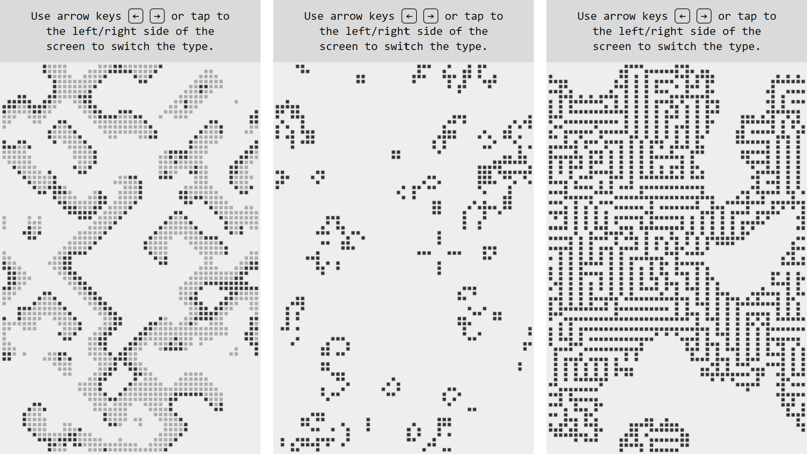

# Cellular automaton

A JavaScript implementation of Conway's Game of Life and other types of [cellular automata](https://en.wikipedia.org/wiki/Cellular_automaton). View demo here: [codepen.io](https://codepen.io/mnbond/pen/MYgQbqX).



## Instructions

1. Add JavaScript code containing class `CellularAutomata` in an HTML document:

    ```html
    <script src="js/cellular-automata.js" type="text/javascript"></script>
    ```

2. Add HTML element for the game in `body` section:

    ```html
    <div id="ca-container"></div>
    ```

3. Сreate an instance of class `CellularAutomata` after the `DOMContentLoaded` event and call method `start`:

    ```js
    document.addEventListener("DOMContentLoaded", () => {
        ca = new CellularAutomata("ca-container", 6, 100);
        ca.start();
    });
    ```

    Class `CellularAutomata` constructor parameters:
    - `containerId` — ID of HTML element for the game;
    - `cellSizePx` — size of cell in pixels, default 10 pixels;
    - `speedMs` — iteration time in milliseconds, default 1000 milliseconds.

## Adding new types of cellular automata

To add new types modify this method of class `CellularAutomata`:
```js
class CellularAutomata {
    ...
    setDefaultProperties() {
        ...
        this.settings = {
            ...
            types: [
                {
                    name: "B3S23",
                    rules: { },
                    genFirstState: (cells, cellsCountX, cellsCountY) => { }
                }
```